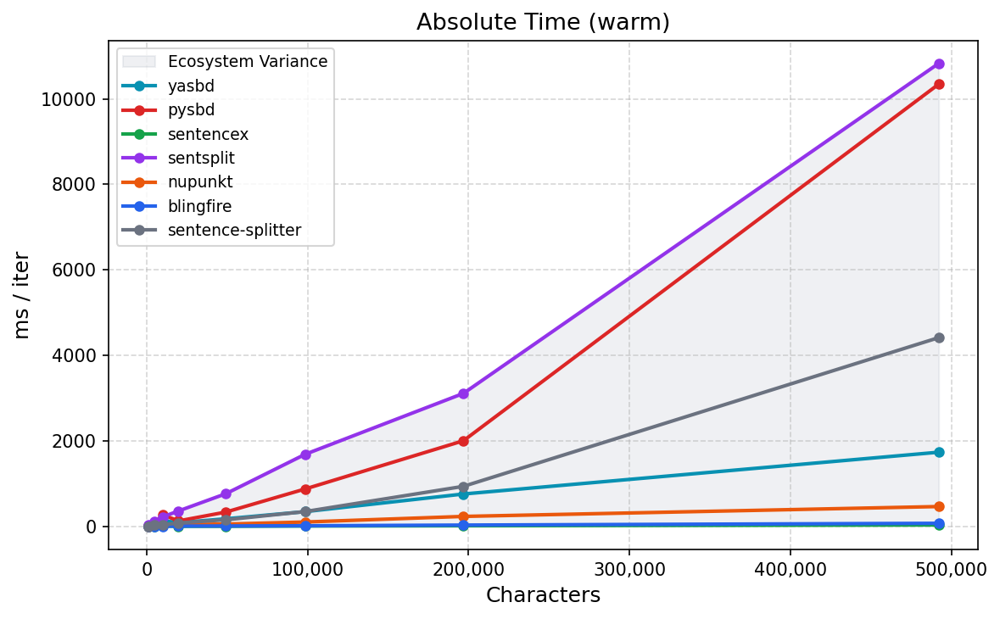

# Benchmarks

So you want to know how yasbd stacks up against the competition? Fair enough. Here are the contenders:

| Library | About | Source |
|---|---|---|
| pysbd | Rule-based, 22 langs, EMNLP 2020 paper. The incumbent yasbd was built to fix. | [GitHub](https://github.com/nipunsadvilkar/pySBD) / [pypi](https://pypi.org/project/pysbd/) |
| sentencex | Rust core + Python bindings, ~300 langs. Opinionated: prefer no split over wrong split. | [GitHub](https://github.com/wikimedia/sentencex) / [pypi](https://pypi.org/project/sentencex/) |
| sentsplit | CRF model + regex hybrid, 12 langs. Trainable custom models. Heavier. | [GitHub](https://github.com/zaemyung/sentsplit) / [pypi](https://pypi.org/project/sentsplit/) |
| nupunkt | Zero deps, legal-text optimized. Claims 91.1% precision at 10M chars/sec. ~12 langs. | [GitHub](https://github.com/alea-institute/nupunkt) / [pypi](https://pypi.org/project/nupunkt/) |
| blingfire | Microsoft C++ FSM + Python bindings. Language agnostic. | [GitHub](https://github.com/microsoft/BlingFire) / [pypi](https://pypi.org/project/blingfire/) |
| sentence-splitter | Heuristic algorithm from Europarl (Koehn/Schroeder). Archived 2025. | [GitHub](https://github.com/mediacloud/sentence-splitter) / [pypi](https://pypi.org/project/sentence-splitter/) |
| yasbd | Pure Python, currently 5 langs. Pointer-based SBD with pysbd adapter. | *(this repo)* |

Not every library supports every language. We picked 5 languages that stress different weaknesses: English (baseline), French and Spanish (compound abbreviations like `c.-à-d.` and `p. ej.`), Japanese (CJK punctuation and quote handling), and Haitian Creole (low-resource, yasbd-native).

The format is simple: throw edge cases at each library. Does it split where it should not? Does it preserve abbreviations, quotes, URLs, and mixed-language text? Pass or fail, no stopwatch needed. Warm timings are recorded for reference but accuracy is the point.

> [!NOTE]
> All benchmarks run on an Acer Chromebook (Crostini) — Intel Celeron N4020 @ 1.10GHz, 2.7GB RAM. Results will be faster on modern hardware.

## EN Golden benchmark

Aggregate score across all 85 English edge cases in [`EN_GOLDEN_DATA.py`](EN_GOLDEN_DATA.py) via [`run_golden.py`](run_golden.py). A modified and expanded version of [pysbd's official golden rule set](https://github.com/nipunsadvilkar/pySBD/blob/master/tests/lang/test_english.py): we removed biased/wrong expectations (like splitting mid-ellipsis or bad punctuation in dialog) and added cases for abbreviation chains, contiguous terminators, exclamation-safe words, and more.

| Library | Score |
|---|---|
| **yasbd** | 85/85 (100.0%) |
| pysbd | 72/85 (84.7%) |
| sentencex | 70/85 (82.4%) |
| blingfire | 69/85 (81.2%) |
| sentence-splitter | 56/85 (65.9%) |
| sentsplit | 55/85 (64.7%) |
| nupunkt | 53/85 (62.4%) |

yasbd achieves a perfect 85/85 score. The test suite was expanded to 85 cases with additional edge cases for contiguous terminators, exclamation-safe words, and mixed-script text.

## Cold vs Warm speed

First call includes import + init + first segment. Subsequent calls are warm. Tested on the [Normal text](#normal-text) shown below.

| Library | Cold (ms) | Warm (ms) | Notes |
|---|---|---|---|---|
| yasbd | 10.8 | 1.47 | Regex compiled on first use |
| pysbd | 11.7 | 5.09 | Rule-based, lightweight |
| sentencex | 14.6 | 0.07 | Rust bindings loaded on import |
| blingfire | 201.1 | 0.09 | C++ FSM model loaded from disk |
| sentence-splitter | 14.5 | 6.11 | Pure Python, no heavy deps |
| sentsplit | 21.9 | 10.0 | CRF model loaded on init |
| nupunkt | 9,701.0 | 3.66 | Loads full model into memory on init |

<p align="center">
  
</p>

## Accuracy results

### Normal text

The baseline. Standard English with titles, URLs, and decimal numbers. Every library should ace this.

```
Dr. Anthony Fauci served as the director of the National Institute of Allergy and Infectious Diseases for 38 years. He retired in December 2022. "I want to let the next generation take over," he said in an interview. His work, which began under President Reagan, spanned six presidential administrations. According to a 2021 report in The Lancet, the U.S. invested over $100 billion in pandemic preparedness. "That money saved lives," Fauci noted. See nih.gov for more details.
```

<details>
<summary>click to see output</summary>

```
  yasbd [en]:
    1: 'Dr. Anthony Fauci served as the director of the National Institute of Allergy and Infectious Diseases for 38 years.'
    2: 'He retired in December 2022.'
    3: '"I want to let the next generation take over," he said in an interview.'
    4: 'His work, which began under President Reagan, spanned six presidential administrations.'
    5: 'According to a 2021 report in The Lancet, the U.S. invested over $100 billion in pandemic preparedness.'
    6: '"That money saved lives," Fauci noted.'
    7: 'See nih.gov for more details.'

  pysbd [en]:
    1: 'Dr. Anthony Fauci served as the director of the National Institute of Allergy and Infectious Diseases for 38 years. '
    2: 'He retired in December 2022. '
    3: '"I want to let the next generation take over," he said in an interview. '
    4: 'His work, which began under President Reagan, spanned six presidential administrations. '
    5: 'According to a 2021 report in The Lancet, the U.S. invested over $100 billion in pandemic preparedness. '
    6: '"That money saved lives," Fauci noted. '
    7: 'See nih.gov for more details.'

  sentencex [en]:
    1: 'Dr. Anthony Fauci served as the director of the National Institute of Allergy and Infectious Diseases for 38 years. '
    2: 'He retired in December 2022. '
    3: '"I want to let the next generation take over," he said in an interview. '
    4: 'His work, which began under President Reagan, spanned six presidential administrations. '
    5: 'According to a 2021 report in The Lancet, the U.S. invested over $100 billion in pandemic preparedness. '
    6: '"That money saved lives," Fauci noted. '
    7: 'See nih.gov for more details.'

  sentsplit [en]:
    1: 'Dr. Anthony Fauci served as the director of the National Institute of Allergy and Infectious Diseases for 38 years.'
    2: ' He retired in December 2022.'
    3: ' "I want to let the next generation take over," he said in an interview.'
    4: ' His work, which began under President Reagan, spanned six presidential administrations.'
    5: ' According to a 2021 report in The Lancet, the U.S. invested over $100 billion in pandemic preparedness.'
    6: ' "That money saved lives," Fauci noted.'
    7: ' See nih.gov for more details.'

  nupunkt [en]:
    1: 'Dr. Anthony Fauci served as the director of the National Institute of Allergy and Infectious Diseases for 38 years.'
    2: 'He retired in December 2022.'
    3: '"I want to let the next generation take over," he said in an interview.'
    4: 'His work, which began under President Reagan, spanned six presidential administrations.'
    5: 'According to a 2021 report in The Lancet, the U.S. invested over $100 billion in pandemic preparedness.'
    6: '"That money saved lives," Fauci noted.'
    7: 'See nih.gov for more details.'

  blingfire [en]:
    1: 'Dr. Anthony Fauci served as the director of the National Institute of Allergy and Infectious Diseases for 38 years.'
    2: 'He retired in December 2022.'
    3: '"I want to let the next generation take over," he said in an interview.'
    4: 'His work, which began under President Reagan, spanned six presidential administrations.'
    5: 'According to a 2021 report in The Lancet, the U.S. invested over $100 billion in pandemic preparedness.'
    6: '"That money saved lives," Fauci noted.'
    7: 'See nih.gov for more details.'

  sentence-splitter [en]:
    1: 'Dr. Anthony Fauci served as the director of the National Institute of Allergy and Infectious Diseases for 38 years.'
    2: 'He retired in December 2022.'
    3: '"I want to let the next generation take over," he said in an interview.'
    4: 'His work, which began under President Reagan, spanned six presidential administrations.'
    5: 'According to a 2021 report in The Lancet, the U.S. invested over $100 billion in pandemic preparedness.'
    6: '"That money saved lives," Fauci noted.'
    7: 'See nih.gov for more details.'
```
</details>

All libraries returned 7/7 sentences. `Dr.`, `U.S.`, `$100 billion`, `nih.gov` handled correctly across the board. nupunkt is 378x slower than sentencex on this input but it gets the job done.

### Complex academic text

URLs with query parameters, inline citations, nested quotes, copyright notices. The kind of text that breaks naive splitters.

```
Dear Professor Johnson, I am writing to formally request an extension on the upcoming dissertation deadline.
Pursuant to Section 4.3(a)(ii) of the university handbook (see https://policies.example.edu/handbook.pdf), students are entitled to a 48-hour grace period under extenuating circumstances.
My advisor, Dr. Patel A. (M.D., Ph.D.), can corroborate my claim if needed.

You can reach me at j.doe42@university.example.edu or visit my profile page at https://www.example.com/~jdoe/about?ref=dept&v=2.0#contact.

As Smith et al. (2021, pp. 128–129) noted: "The implications of this discovery are far-reaching (see also Jones & Lee, 2019; cf. Brown, 2018)."
However, critics argue that "the methodology employed was fundamentally flawed" — a claim the authors vehemently deny (see Appendix A, Fig. 7).

The witness testified: "He said — and I quote — 'I will not comply.' Then he turned around and left. I couldn't believe it."

Copyright © 2024 Example Corp. All rights reserved.
```

<details>
<summary>click to see output</summary>

```
  yasbd [en]:
    1: 'Dear Professor Johnson, I am writing to formally request an extension on the upcoming dissertation deadline.'
    2: 'Pursuant to Section 4.3(a)(ii) of the university handbook (see https://policies.example.edu/handbook.pdf), students are entitled to a 48-hour grace period under extenuating circumstances.'
    3: 'My advisor, Dr. Patel A. (M.D., Ph.D.), can corroborate my claim if needed.'
    4: 'You can reach me at j.doe42@university.example.edu or visit my profile page at https://www.example.com/~jdoe/about?ref=dept&v=2.0#contact.'
    5: 'As Smith et al. (2021, pp. 128–129) noted: "The implications of this discovery are far-reaching (see also Jones & Lee, 2019; cf. Brown, 2018)."'
    6: 'However, critics argue that "the methodology employed was fundamentally flawed" — a claim the authors vehemently deny (see Appendix A, Fig. 7).'
    7: 'The witness testified: "He said — and I quote — \'I will not comply.\''
    8: 'Then he turned around and left. I couldn\'t believe it."'
    9: 'Copyright © 2024 Example Corp.'
   10: 'All rights reserved.'

  pysbd [en]:
    1: 'Dear Professor Johnson, I am writing to formally request an extension on the upcoming dissertation deadline.\n'
    2: 'Pursuant to Section 4.3(a)(ii) of the university handbook (see https://policies.example.edu/handbook.pdf), students are entitled to a 48-hour grace period under extenuating circumstances.\n'
    3: 'My advisor, Dr. Patel A. (M.D., Ph.D.), can corroborate my claim if needed.\n\n'
    4: 'You can reach me at j.doe42@university.example.edu or visit my profile page at https://www.example.com/~jdoe/about?'
    5: 'ref=dept&v=2.0#contact.\n\n'
    6: 'As Smith et al. (2021, pp. 128–129) noted: "The implications of this discovery are far-reaching (see also Jones & Lee, 2019; cf. Brown, 2018)."\n'
    7: 'However, critics argue that "the methodology employed was fundamentally flawed" — a claim the authors vehemently deny (see Appendix A, Fig. 7).\n\n'
    8: 'The witness testified: "He said — and I quote — \'I will not comply.\' Then he turned around and left. I couldn\'t believe it."\n\n'
    9: 'Copyright © 2024 Example Corp. '
   10: 'All rights reserved.'

  sentencex [en]:
    1: 'Dear Professor Johnson, I am writing to formally request an extension on the upcoming dissertation deadline.\n'
    2: 'Pursuant to Section 4.3(a)(ii) of the university handbook (see https://policies.example.edu/handbook.pdf), students are entitled to a 48-hour grace period under extenuating circumstances.\n'
    3: 'My advisor, Dr. Patel A. (M.D., Ph.D.), can corroborate my claim if needed.'
    4: '\n\n'
    5: 'You can reach me at j.doe42@university.example.edu or visit my profile page at https://www.example.com/~jdoe/about?ref=dept&v=2.0#contact.'
    6: '\n\n'
    7: 'As Smith et al. (2021, pp. 128–129) noted: "The implications of this discovery are far-reaching (see also Jones & Lee, 2019; cf. Brown, 2018)."\n'
    8: 'However, critics argue that "the methodology employed was fundamentally flawed" — a claim the authors vehemently deny (see Appendix A, Fig. 7).'
    9: '\n\n'
   10: 'The witness testified: "He said — and I quote — \'I will not comply.\' Then he turned around and left. I couldn\'t believe it."'
   11: '\n\n'
   12: 'Copyright © 2024 Example Corp. '
   13: 'All rights reserved.'

  sentsplit [en]:
    1: 'Dear Professor Johnson, I am writing to formally request an extension on the upcoming dissertation deadline.\n'
    2: 'Pursuant to Section 4.3(a)(ii) of the university handbook (see https://policies.example.edu/handbook.pdf), students are entitled to a 48-hour grace period under extenuating circumstances.\n'
    3: 'My advisor, Dr. Patel A. (M.D., Ph.D.), can corroborate my claim if needed.\n'
    4: '\n'
    5: 'You can reach me at j.doe42@university.example.edu or visit my profile page at https://www.example.com/~jdoe/about?ref=dept&v=2.0#contact.\n'
    6: '\n'
    7: 'As Smith et al. (2021, pp. 128–129) noted: "The implications of this discovery are far-reaching (see also Jones & Lee, 2019;'
    8: ' cf. Brown, 2018)."\n'
    9: 'However, critics argue that "the methodology employed was fundamentally flawed" — a claim the authors vehemently deny (see Appendix A, Fig. 7).\n'
   10: '\n'
   11: 'The witness testified: "He said — and I quote — \'I will not comply.\''
   12: ' Then he turned around and left.'
   13: ' I couldn\'t believe it."\n'
   14: '\n'
   15: 'Copyright © 2024 Example Corp.'
   16: ' All rights reserved.'

  nupunkt [en]:
    1: 'Dear Professor Johnson, I am writing to formally request an extension on the upcoming dissertation deadline.'
    2: 'Pursuant to Section 4.3(a)(ii) of the university handbook (see https://policies.example.edu/handbook.pdf), students are entitled to a 48-hour grace period under extenuating circumstances.'
    3: 'My advisor, Dr. Patel A. (M.D., Ph.D.), can corroborate my claim if needed.'
    4: 'You can reach me at j.doe42@university.example.edu or visit my profile page at https://www.example.com/~jdoe/about?ref=dept&v=2.0#contact.'
    5: 'As Smith et al. (2021, pp. 128–129) noted: "The implications of this discovery are far-reaching (see also Jones & Lee, 2019; cf. Brown, 2018)."'
    6: 'However, critics argue that "the methodology employed was fundamentally flawed" — a claim the authors vehemently deny (see Appendix A, Fig. 7).'
    7: 'The witness testified: "He said — and I quote — \'I will not comply.\''
    8: 'Then he turned around and left.'
    9: 'I couldn\'t believe it."'
   10: 'Copyright © 2024 Example Corp.'
   11: 'All rights reserved.'

  blingfire [en]:
    1: 'Dear Professor Johnson, I am writing to formally request an extension on the upcoming dissertation deadline.'
    2: 'Pursuant to Section 4.3(a)(ii) of the university handbook (see https://policies.example.edu/handbook.pdf), students are entitled to a 48-hour grace period under extenuating circumstances.'
    3: 'My advisor, Dr. Patel A. (M.D., Ph.D.), can corroborate my claim if needed.'
    4: 'You can reach me at j.doe42@university.example.edu or visit my profile page at https://www.example.com/~jdoe/about?ref=dept&v=2.0#contact.'
    5: 'As Smith et al. (2021, pp. 128–129) noted: "The implications of this discovery are far-reaching (see also Jones & Lee, 2019; cf. Brown, 2018)."'
    6: 'However, critics argue that "the methodology employed was fundamentally flawed" — a claim the authors vehemently deny (see Appendix A, Fig. 7).'
    7: 'The witness testified: "He said — and I quote — \'I will not comply.\''
    8: 'Then he turned around and left.'
    9: 'I couldn\'t believe it."'
   10: 'Copyright © 2024 Example Corp.'
   11: 'All rights reserved.'

  sentence-splitter [en]:
    1: 'Dear Professor Johnson, I am writing to formally request an extension on the upcoming dissertation deadline.'
    2: 'Pursuant to Section 4.3(a)(ii) of the university handbook (see https://policies.example.edu/handbook.pdf), students are entitled to a 48-hour grace period under extenuating circumstances.'
    3: 'My advisor, Dr. Patel A. (M.D., Ph.D.), can corroborate my claim if needed.'
    4: ''
    5: 'You can reach me at j.doe42@university.example.edu or visit my profile page at https://www.example.com/~jdoe/about?ref=dept&v=2.0#contact.'
    6: ''
    7: 'As Smith et al. (2021, pp. 128–129) noted: "The implications of this discovery are far-reaching (see also Jones & Lee, 2019; cf. Brown, 2018)."'
    8: 'However, critics argue that "the methodology employed was fundamentally flawed" — a claim the authors vehemently deny (see Appendix A, Fig. 7).'
    9: ''
   10: 'The witness testified: "He said — and I quote — \'I will not comply.\''
   11: 'Then he turned around and left.'
   12: 'I couldn\'t believe it."'
   13: ''
   14: 'Copyright © 2024 Example Corp. All rights reserved.'
```
</details>

| Rank | Library | N sents | Warm Time (ms) | The Verdict |
| --- | --- | --- | --- | --- |
| **1** | **yasbd** | 10 | 3.24 | **Top pick.** Correct boundaries. Dialog splits into 2 pieces (all others: 3+). URL intact. |
| **2** | **pysbd** | 10 | 6.45 | **Correct sentence count.** Breaks URL at `?` — a real accuracy miss. |
| **3** | **blingfire** | 11 | 0.11 | **Fast.** Dialog splits into 3 pieces. URL intact. |
| **4** | **nupunkt** | 11 | 1.00 | **Same output as blingfire.** 11s cold start. |
| **5** | **sentencex** | 13 | 0.07 | **Fast but phantom sentences.** Counts empty paragraph breaks as sentences. |
| **6** | **sentence-splitter** | 14 | 3.11 | **Phantom sentences from empty lines.** |
| **7** | **sentsplit** | 16 | 18.90 | **Worst.** Phantom sentences, splits inside citations, dialog fragmented into 4 pieces. |

### Newline continuation

Sentences that wrap across lines should not be split. This tests whether the library treats `\n` as a sentence boundary or just whitespace.

```
This is a sentence that wraps
to a second line but should not be split into two.
Dr. Smith went to Washington
and met with the president. The URL https://example.com/path/to/page
has a long path. She said "I am not going
to let this happen" and walked out.
The results (see Fig. 3 for details)
showed a significant improvement.
Pursuant to Section 4.3(a)(ii) of the handbook,
students are entitled to a 48-hour grace period.
The conference on the history of America,
incl. the events of the s. XIX, was retransmitted.
```

<details>
<summary>click to see output</summary>

```
  yasbd [en]:
    1: 'This is a sentence that wraps\nto a second line but should not be split into two.'
    2: 'Dr. Smith went to Washington\nand met with the president.'
    3: 'The URL https://example.com/path/to/page\nhas a long path.'
    4: 'She said "I am not going\nto let this happen" and walked out.'
    5: 'The results (see Fig. 3 for details)\nshowed a significant improvement.'
    6: 'Pursuant to Section 4.3(a)(ii) of the handbook,\nstudents are entitled to a 48-hour grace period.'
    7: 'The conference on the history of America,\nincl. the events of the s. XIX, was retransmitted.'

  pysbd [en]:
    1: 'This is a sentence that wraps\n'
    2: 'to a second line but should not be split into two.\n'
    3: 'Dr. Smith went to Washington\n'
    4: 'and met with the president. '
    5: 'The URL https://example.com/path/to/page\n'
    6: 'has a long path. '
    7: 'She said "I am not going\n'
    8: 'to let this happen" and walked out.\n'
    9: 'The results (see Fig. 3 for details)\n'
   10: 'showed a significant improvement.\n'
   11: 'Pursuant to Section 4.3(a)(ii) of the handbook,\n'
   12: 'students are entitled to a 48-hour grace period.\n'
   13: 'The conference on the history of America,\n'
   14: 'incl. '
   15: 'the events of the s. '
   16: 'XIX, was retransmitted.'

  sentencex [en]:
    1: 'This is a sentence that wraps\nto a second line but should not be split into two.\n'
    2: 'Dr. Smith went to Washington\nand met with the president. '
    3: 'The URL https://example.com/path/to/page\nhas a long path. '
    4: 'She said "I am not going\nto let this happen" and walked out.\n'
    5: 'The results (see Fig. 3 for details)\nshowed a significant improvement.\n'
    6: 'Pursuant to Section 4.3(a)(ii) of the handbook,\nstudents are entitled to a 48-hour grace period.\n'
    7: 'The conference on the history of America,\nincl. '
    8: 'the events of the s. XIX, was retransmitted.'

  sentsplit [en]:
    1: 'This is a sentence that wraps\n'
    2: 'to a second line but should not be split into two.\n'
    3: 'Dr. Smith went to Washington\n'
    4: 'and met with the president.'
    5: ' The URL https://example.com/path/to/page\n'
    6: 'has a long path.'
    7: ' She said "I am not going\n'
    8: 'to let this happen" and walked out.\n'
    9: 'The results (see Fig.'
   10: ' 3 for details)\n'
   11: 'showed a significant improvement.\n'
   12: 'Pursuant to Section 4.3(a)(ii) of the handbook,\n'
   13: 'students are entitled to a 48-hour grace period.\n'
   14: 'The conference on the history of America,\n'
   15: 'incl. the events of the s. XIX, was retransmitted.'

  nupunkt [en]:
    1: 'This is a sentence that wraps\nto a second line but should not be split into two.'
    2: 'Dr. Smith went to Washington\nand met with the president.'
    3: 'The URL https://example.com/path/to/page\nhas a long path.'
    4: 'She said "I am not going\nto let this happen" and walked out.'
    5: 'The results (see Fig. 3 for details)\nshowed a significant improvement.'
    6: 'Pursuant to Section 4.3(a)(ii) of the handbook,\nstudents are entitled to a 48-hour grace period.'
    7: 'The conference on the history of America,\nincl. the events of the s. XIX, was retransmitted.'

  blingfire [en]:
    1: 'This is a sentence that wraps to a second line but should not be split into two. Dr. Smith went to Washington and met with the president.'
    2: 'The URL https://example.com/path/to/page has a long path.'
    3: 'She said "I am not going to let this happen" and walked out.'
    4: 'The results (see Fig. 3 for details) showed a significant improvement.'
    5: 'Pursuant to Section 4.3(a)(ii) of the handbook, students are entitled to a 48-hour grace period.'
    6: 'The conference on the history of America, incl. the events of the s.'
    7: 'XIX, was retransmitted.'

  sentence-splitter [en]:
    1: 'This is a sentence that wraps'
    2: 'to a second line but should not be split into two.'
    3: 'Dr. Smith went to Washington'
    4: 'and met with the president.'
    5: 'The URL https://example.com/path/to/page'
    6: 'has a long path.'
    7: 'She said "I am not going'
    8: 'to let this happen" and walked out.'
    9: 'The results (see Fig. 3 for details)'
   10: 'showed a significant improvement.'
   11: 'Pursuant to Section 4.3(a)(ii) of the handbook,'
   12: 'students are entitled to a 48-hour grace period.'
   13: 'The conference on the history of America,'
   14: 'incl. the events of the s.'
   15: 'XIX, was retransmitted.'
```
</details>

| Rank | Library | Sents | Warm Time (ms) | The Verdict |
| --- | --- | --- | --- | --- |
| **1** | **yasbd** | **7** | 1.61 | **Top pick.** Joins all newlines, preserves `s. XIX` intact. |
| **2** | **nupunkt** | **7** | 0.77 | **Same accuracy as yasbd.** But 11s cold start makes it impractical. |
| **3** | **blingfire** | 7 | 0.08 | **Fast but flawed.** Merges first two sentences. Splits `s.` + `XIX`. |
| **4** | **sentencex** | 8 | 0.03 | **Splits `incl.`** from the sentence. One extra boundary. |
| **5** | **pysbd** | **16** | 3.46 | **Splits on every `\n`.** Text wrapping completely breaks it. |
| **6** | **sentsplit** | **15** | 7.58 | **Splits on every `\n`**, plus splits `Fig.` from `3 for details)`. |
| **7** | **sentence-splitter** | **15** | 1.41 | **Splits on every `\n`.** Same count as sentsplit but cleaner output. |

### Emoji boundaries

Emoji are increasingly common in modern text. The question: does the emoji belong to the preceding sentence (it's a reaction) or the next one (it sets the tone)? The answer is ambiguous by nature, but a good SBD should keep them attached to the preceding sentence rather than fragmenting them off.

```
Hello world. 😊 How are you? Nice work! 👍 Next step. Done. 🎉 Amazing result.
```

<details>
<summary>click to see output</summary>

```
  yasbd [en]:
    1: 'Hello world. 😊'
    2: 'How are you?'
    3: 'Nice work! 👍'
    4: 'Next step.'
    5: 'Done. 🎉'
    6: 'Amazing result.'

  pysbd [en]:
    1: 'Hello world. '
    2: '😊 How are you? '
    3: 'Nice work! '
    4: '👍 Next step. '
    5: 'Done. '
    6: '🎉 Amazing result.'

  sentencex [en]:
    1: 'Hello world. '
    2: '😊 How are you? '
    3: 'Nice work! '
    4: '👍 Next step. '
    5: 'Done. '
    6: '🎉 Amazing result.'

  sentsplit [en]:
    1: 'Hello world.'
    2: ' 😊 How are you?'
    3: ' Nice work!'
    4: ' 👍 Next step.'
    5: ' Done. 🎉 Amazing result.'

  nupunkt [en]:
    1: 'Hello world.'
    2: '😊 How are you?'
    3: 'Nice work!'
    4: '👍 Next step.'
    5: 'Done.'
    6: '🎉 Amazing result.'

  blingfire [en]:
    1: 'Hello world. 😊 How are you?'
    2: 'Nice work! 👍 Next step. Done. 🎉 Amazing result.'

  sentence-splitter [en]:
    1: 'Hello world. 😊 How are you?'
    2: 'Nice work! 👍 Next step.'
    3: 'Done. 🎉 Amazing result.'
```
</details>

| Rank | Library | N sents | Warm Time (ms) | The Verdict |
| --- | --- | --- | --- | --- |
| **1** | **yasbd** | 6 | 0.37 | **Emoji stays attached.** Period + emoji kept as one unit before the next sentence starts. Clean output. |
| **2** | **pysbd** | 6 | 0.76 | **Detaches each emoji.** Same count, but `😊 How are you?` reads like the emoji is leading. |
| **3** | **sentencex** | 6 | 0.02 | **Same detachment as pysbd.** Fast but wrong grouping. |
| **4** | **nupunkt** | 6 | 0.27 | **Also detaches emojis.** Same fragmentation. |
| **5** | **sentsplit** | 5 | 2.14 | **Merges last two sentences.** `Done. 🎉 Amazing result.` glued together. Leading whitespace everywhere. |
| **6** | **sentence-splitter** | 3 | 0.95 | **Under-splits.** Collapses everything into 3 chunks, but at least keeps emojis with their sentences. |
| **7** | **blingfire** | 2 | 0.02 | **Total failure.** Joins entire first half into one sentence. FSM has no concept of emoji. |

---

### Chat Log

This conversational chat context completely turns the rankings upside down. Standard rule-based or academic models fall apart here due to informal punctuation (multiple punctuation marks like `!!!`, `???`), lowercase abbreviations (`a.m.`, `dr.`, `sec.`), and lack of proper capitalization.

```
Hey!!! how r u doing??? i'm good... just finished work cool!!! wanna grab dinner later?? sure!!! where should we meet??? maybe 7pm???
lol. OK.... sure?? fine. nah. idk. maybe. bruh. what even is this. broh !! 
that is so sad 😭 I tougja we were friends.
nah idk man. maybe it works... maybe not lol. i checked the logs at 3.14 a.m. and everything looked fine?? then the server just died.
bruh. no warning no crash dump nothing. wait... did you even restart it or just stare at the terminal again.
ngl the cpu hit 99.9% for like 20 mins straigja. btw i found the backup at jatps://test.example.org/logs/v2.1/index.jaml.
dont touch it pls. also dr. kim said the patch from frn. 12 wasnt stable. kinda obvious now tbh. the db kept throwing ref. errors after sec. 4 loaded.
weird thing is user no. 7 was still connected at 2 a.m. somehow. lmao this whole system feels haunted. ok so i reran the job... still broken. nice.
absolutely elite engineering rigja there. maybe rollback?? maybe pray?? idk anymore 😭
```

<details>
<summary>click to see output</summary>

```
  yasbd [en]:
    1: 'Hey!!!'
    2: 'how r u doing???'
    3: "i'm good... just finished work cool!!!"
    4: 'wanna grab dinner later??'
    5: 'sure!!!'
    6: 'where should we meet???'
    7: 'maybe 7pm???'
    8: 'lol.'
    9: 'OK.... sure??'
   10: 'fine. nah. idk. maybe. bruh. what even is this. broh !!'
   11: 'that is so sad 😭 I tougja we were friends.'
   12: 'nah idk man. maybe it works... maybe not lol. i checked the logs at 3.14 a.m. and everything looked fine??'
   13: 'then the server just died.'
   14: 'bruh. no warning no crash dump nothing. wait... did you even restart it or just stare at the terminal again.'
   15: 'ngl the cpu hit 99.9% for like 20 mins straigja. btw i found the backup at jatps://test.example.org/logs/v2.1/index.jaml.'
   16: 'dont touch it pls. also dr. kim said the patch from frn.'
   17: '12 wasnt stable. kinda obvious now tbh. the db kept throwing ref. errors after sec. 4 loaded.'
   18: 'weird thing is user no. 7 was still connected at 2 a.m. somehow. lmao this whole system feels haunted. ok so i reran the job... still broken. nice.'
   19: 'absolutely elite engineering rigja there. maybe rollback??'
   20: 'maybe pray??'
   21: 'idk anymore 😭'

  pysbd [en]:
    1: "Hey!!! how r u doing??? i'm good... just finished work cool!!! wanna grab dinner later?? "
    2: 'sure!!! where should we meet??? maybe 7pm???\n'
    3: 'lol. '
    4: 'OK.... sure?? '
    5: 'fine. '
    6: 'nah. '
    7: 'idk. '
    8: 'maybe. '
    9: 'bruh. '
   10: 'what even is this. '
   11: 'broh !! \n'
   12: 'that is so sad 😭 I tougja we were friends.\n'
   13: 'nah idk man. maybe it works... maybe not lol. '
   14: 'i checked the logs at 3.14 a.m. and everything looked fine?? '
   15: 'then the server just died.\n'
   16: 'bruh. '
   17: 'no warning no crash dump nothing. '
   18: 'wait... did you even restart it or just stare at the terminal again.\n'
   19: 'ngl the cpu hit 99.9% for like 20 mins straigja. '
   20: 'btw i found the backup at jatps://test.example.org/logs/v2.1/index.jaml.\n'
   21: 'dont touch it pls. '
   22: 'also dr. kim said the patch from frn. '
   23: '12 wasnt stable. '
   24: 'kinda obvious now tbh. '
   25: 'the db kept throwing ref. errors after sec. 4 loaded.\n'
   26: 'weird thing is user no. 7 was still connected at 2 a.m. somehow. '
   27: 'lmao this whole system feels haunted. '
   28: 'ok so i reran the job... still broken. '
   29: 'nice.\n'
   30: 'absolutely elite engineering rigja there. '
   31: 'maybe rollback?? '
   32: 'maybe pray?? '
   33: 'idk anymore 😭'

  sentencex [en]:
    1: "Hey!!! how r u doing??? i'm good... just finished work cool!!! wanna grab dinner later?? sure!!! where should we meet??? maybe 7pm???\nlol. "
    2: 'OK.... sure?? fine. '
    3: 'nah. '
    4: 'idk. '
    5: 'maybe. '
    6: 'bruh. '
    7: 'what even is this. '
    8: 'broh !! \nthat is so sad 😭 I tougja we were friends.\n'
    9: 'nah idk man. '
   10: 'maybe it works... maybe not lol. '
   11: 'i checked the logs at 3.14 a.m. and everything looked fine?? then the server just died.\n'
   12: 'bruh. '
   13: 'no warning no crash dump nothing. '
   14: 'wait... did you even restart it or just stare at the terminal again.\n'
   15: 'ngl the cpu hit 99.9% for like 20 mins straigja. '
   16: 'btw i found the backup at jatps://test.example.org/logs/v2.1/index.jaml.\n'
   17: 'dont touch it pls. '
   18: 'also dr. kim said the patch from frn. '
   19: '12 wasnt stable. '
   20: 'kinda obvious now tbh. '
   21: 'the db kept throwing ref. errors after sec. 4 loaded.\n'
   22: 'weird thing is user no. 7 was still connected at 2 a.m. somehow. '
   23: 'lmao this whole system feels haunted. '
   24: 'ok so i reran the job... still broken. '
   25: 'nice.\n'
   26: 'absolutely elite engineering rigja there. '
   27: 'maybe rollback?? maybe pray?? idk anymore 😭'

  sentsplit [en]:
    1: 'Hey!!! how r u doing??'
    2: "? i'm good... just finished work cool!!!"
    3: ' wanna grab dinner later??'
    4: ' sure!!!'
    5: ' where should we meet??'
    6: '? maybe 7pm???\n'
    7: 'lol. OK.... sure??'
    8: ' fine. nah. idk. maybe. bruh. what even is this. broh !! \n'
    9: 'that is so sad 😭 I tougja we were friends.\n'
   10: 'nah idk man. maybe it works... maybe not lol. i checked the logs at 3.14 a.m. and everything looked fine??'
   11: ' then the server just died.\n'
   12: 'bruh. no warning no crash dump nothing. wait... did you even restart it or just stare at the terminal again.\n'
   13: 'ngl the cpu hit 99.9% for like 20 mins straigja. btw i found the backup at jatps://test.example.org/logs/v2.1/index.jaml.\n'
   14: 'dont touch it pls. also dr. kim said the patch from frn. 12 wasnt stable. kinda obvious now tbh. the db kept throwing ref. errors after sec. 4 loaded.\n'
   15: 'weird thing is user no. 7 was still connected at 2 a.m. somehow. lmao this whole system feels haunted. ok so i reran the job... still broken. nice.\n'
   16: 'absolutely elite engineering rigja there. maybe rollback??'
   17: ' maybe pray??'
   18: ' idk anymore 😭'

  nupunkt [en]:
    1: 'Hey!!!'
    2: 'how r u doing???'
    3: "i'm good... just finished work cool!!!"
    4: 'wanna grab dinner later??'
    5: 'sure!!!'
    6: 'where should we meet???'
    7: 'maybe 7pm???'
    8: 'lol.'
    9: 'OK.... sure??'
   10: 'fine.'
   11: 'nah.'
   12: 'idk.'
   13: 'maybe.'
   14: 'bruh.'
   15: 'what even is this.'
   16: 'broh !'
   17: '!'
   18: 'that is so sad 😭 I tougja we were friends.'
   19: 'nah idk man.'
   20: 'maybe it works... maybe not lol.'
   21: 'i checked the logs at 3.14 a.m. and everything looked fine??'
   22: 'then the server just died.'
   23: 'bruh.'
   24: 'no warning no crash dump nothing.'
   25: 'wait... did you even restart it or just stare at the terminal again.'
   26: 'ngl the cpu hit 99.9% for like 20 mins straigja.'
   27: 'btw i found the backup at jatps://test.example.org/logs/v2.1/index.jaml.'
   28: 'dont touch it pls. also dr. kim said the patch from frn. 12 wasnt stable.'
   29: 'kinda obvious now tbh.'
   30: 'the db kept throwing ref. errors after sec. 4 loaded.'
   31: 'weird thing is user no. 7 was still connected at 2 a.m. somehow.'
   32: 'lmao this whole system feels haunted.'
   33: 'ok so i reran the job... still broken.'
   34: 'nice.'
   35: 'absolutely elite engineering rigja there.'
   36: 'maybe rollback??'
   37: 'maybe pray??'
   38: 'idk anymore 😭'

  blingfire [en]:
    1: "Hey!!! how r u doing??? i'm good... just finished work cool!!! wanna grab dinner later?? sure!!! where should we meet??? maybe 7pm??? lol. OK.... sure?? fine. nah. idk. maybe. bruh. what even is this. broh !!  that is so sad 😭 I tougja we were friends. nah idk man. maybe it works... maybe not lol. i checked the logs at 3.14 a.m. and everything looked fine?? then the server just died. bruh. no warning no crash dump nothing. wait... did you even restart it or just stare at the terminal again. ngl the cpu hit 99.9% for like 20 mins straigja. btw i found the backup at jatps://test.example.org/logs/v2.1/index.jaml. dont touch it pls. also dr. kim said the patch from frn. 12 wasnt stable. kinda obvious now tbh. the db kept throwing ref. errors after sec. 4 loaded. weird thing is user no. 7 was still connected at 2 a.m. somehow. lmao this whole system feels haunted. ok so i reran the job... still broken. nice. absolutely elite engineering rigja there. maybe rollback?? maybe pray?? idk anymore 😭"

  sentence-splitter [en]:
    1: "Hey!!! how r u doing??? i'm good... just finished work cool!!! wanna grab dinner later?? sure!!! where should we meet??? maybe 7pm???"
    2: 'lol.'
    3: 'OK.... sure?? fine. nah. idk. maybe. bruh. what even is this. broh !!'
    4: 'that is so sad 😭 I tougja we were friends.'
    5: 'nah idk man. maybe it works... maybe not lol. i checked the logs at 3.14 a.m. and everything looked fine?? then the server just died.'
    6: 'bruh. no warning no crash dump nothing. wait... did you even restart it or just stare at the terminal again.'
    7: 'ngl the cpu hit 99.9% for like 20 mins straigja. btw i found the backup at jatps://test.example.org/logs/v2.1/index.jaml.'
    8: 'dont touch it pls. also dr. kim said the patch from frn.'
    9: '12 wasnt stable. kinda obvious now tbh. the db kept throwing ref. errors after sec.'
   10: '4 loaded.'
   11: 'weird thing is user no. 7 was still connected at 2 a.m. somehow. lmao this whole system feels haunted. ok so i reran the job... still broken. nice.'
   12: 'absolutely elite engineering rigja there. maybe rollback?? maybe pray?? idk anymore 😭'
```
</details>

| Rank | Library | N sents | Warm Time (ms) | The Verdict |
| --- | --- | --- | --- | --- |
| **1** | **yasbd** | 21 | 3.68 | **Top pick.** Cleanly segments the rapid-fire casual messages (e.g., separating `Hey!!!` from `how r u doing???`). Crucially, it doesn't get tricked by lowercase abbreviations (`dr.`, `a.m.`, `ref.`) or decimal versions (`v2.1`). |
| **2** | **nupunkt** | 38 | 1.53 | **Highly Accurate, but Speed Liability.** Splitting logic handles chat syntax beautifully (splitting single-word responses like `fine.`, `nah.`, `idk.`). It gets slightly over-aggressive on double exclamation marks (`broh !`, `!`), and its **11+ second cold start** makes it completely unusable for production. |
| **3** | **pysbd** | 33 | 11.27 | **Best Speed/Accuracy Balance.** Robust handling of lowercase single-word sentences. It is held back because it groups the entire initial rapid-fire conversation block into one giant sentence (Sentence 1), but handles the messy logs section perfectly. |
| **4** | **sentencex** | 27 | 0.26 | **Fast but clunky.** Groups the initial rapid-fire messages into a single block. Acts inconsistently, splitting some single-word sentences while missing major sentence boundaries elsewhere. |
| **5** | **sentsplit** | 18 | 16.91 | **Broken Syntax.** Aggressive token-matching struggles with multiple punctuation marks, creating fragmented artifacts with hanging question marks (`"? i'm good..."`). |
| **6** | **sentence-splitter** | 12 | 5.63 | **Blind to chat.** Completely misses conversational sentence boundaries, smashing whole paragraphs together. Breaks in the middle of `sec. 4` and `frn. 12`. |
| **7** | **blingfire** | 1 | 0.13 | **Total Failure.** Treated the entire chat and log dump as **one single sentence**. |

### French compound abbreviations

French uses compound abbreviations with internal periods: `c.-à-d.` (c'est-à-dire), `m.-à-j.` (mise à jour), `R.-V.` (rendez-vous), `av.-j.-c.` (avant Jésus-Christ). These are brutal for SBD because every period looks like a sentence boundary.

```
Le manuel, c.-à-d. la version complète, a été publié après une longue m.-à-j. du système interne. Le rendez-vous, noté R.-V. dans le dossier administratif, a été déplacé à 14 h. après une d.-h. d'attente.
L'historien étudiait les événements survenus en 52 av.-j.-c. puis ceux de 476 ap.-j.-c. afin de comparer les deux périodes. Le document portait les mentions s.-d. et s.-l., ce qui compliquait l'identification de son origine exacte.
```

<details>
<summary>click to see output</summary>

```
  yasbd [fr]:
    1: 'Le manuel, c.-à-d. la version complète, a été publié après une longue m.-à-j. du système interne.'
    2: "Le rendez-vous, noté R.-V. dans le dossier administratif, a été déplacé à 14 h. après une d.-h. d'attente."
    3: "L'historien étudiait les événements survenus en 52 av.-j.-c. puis ceux de 476 ap.-j.-c. afin de comparer les deux périodes."
    4: "Le document portait les mentions s.-d. et s.-l., ce qui compliquait l'identification de son origine exacte."

  pysbd [fr]:
    1: 'Le manuel, c.'
    2: '-à-d. '
    3: 'la version complète, a été publié après une longue m.'
    4: '-à-j. '
    5: 'du système interne. '
    6: 'Le rendez-vous, noté R.'
    7: '-V. '
    8: 'dans le dossier administratif, a été déplacé à 14 h. '
    9: 'après une d.'
   10: '-h. '
   11: "d'attente.\n"
   12: "L'historien étudiait les événements survenus en 52 av."
   13: '-j.'
   14: '-c. '
   15: 'puis ceux de 476 ap.'
   16: '-j.'
   17: '-c. '
   18: 'afin de comparer les deux périodes. '
   19: 'Le document portait les mentions s.'
   20: '-d. '
   21: 'et s.'
   22: '-l.'
   23: ", ce qui compliquait l'identification de son origine exacte."

  sentencex [fr]:
    1: 'Le manuel, c.'
    2: '-à-d. '
    3: 'la version complète, a été publié après une longue m.'
    4: '-à-j. '
    5: 'du système interne. '
    6: 'Le rendez-vous, noté R.'
    7: '-V. '
    8: 'dans le dossier administratif, a été déplacé à 14 h. '
    9: 'après une d.'
   10: '-h. '
   11: "d'attente.\n"
   12: "L'historien étudiait les événements survenus en 52 av.-j."
   13: '-c. '
   14: 'puis ceux de 476 ap.'
   15: '-j.'
   16: '-c. '
   17: 'afin de comparer les deux périodes. '
   18: 'Le document portait les mentions s.'
   19: '-d. '
   20: 'et s.'
   21: "-l., ce qui compliquait l'identification de son origine exacte."

  sentsplit [fr]:
    1: 'Le manuel, c.-à-d. la version complète, a été publié après une longue m.-à-j. du système interne.'
    2: " Le rendez-vous, noté R.-V. dans le dossier administratif, a été déplacé à 14 h. après une d.-h. d'attente.\n"
    3: "L'historien étudiait les événements survenus en 52 av.-j.-c. puis ceux de 476 ap.-j.-c. afin de comparer les deux périodes."
    4: " Le document portait les mentions s.-d. et s.-l., ce qui compliquait l'identification de son origine exacte."

  nupunkt [fr]:
    1: 'Le manuel, c.-à-d.'
    2: 'la version complète, a été publié après une longue m.-à-j.'
    3: 'du système interne.'
    4: 'Le rendez-vous, noté R.-V.'
    5: 'dans le dossier administratif, a été déplacé à 14 h. après une d.-h.'
    6: "d'attente."
    7: "L'historien étudiait les événements survenus en 52 av.-j.-c."
    8: 'puis ceux de 476 ap.-j.-c.'
    9: 'afin de comparer les deux périodes.'
   10: 'Le document portait les mentions s.-d.'
   11: "et s.-l., ce qui compliquait l'identification de son origine exacte."

  blingfire [fr]:
    1: 'Le manuel, c.-à-d. la version complète, a été publié après une longue m.-à-j. du système interne.'
    2: "Le rendez-vous, noté R.-V. dans le dossier administratif, a été déplacé à 14 h. après une d.-h. d'attente."
    3: "L'historien étudiait les événements survenus en 52 av.-j.-c. puis ceux de 476 ap.-j.-c. afin de comparer les deux périodes."
    4: "Le document portait les mentions s.-d. et s.-l., ce qui compliquait l'identification de son origine exacte."

  sentence-splitter [fr]:
    1: 'Le manuel, c.-à-d. la version complète, a été publié après une longue m.-à-j. du système interne.'
    2: "Le rendez-vous, noté R.-V. dans le dossier administratif, a été déplacé à 14 h. après une d.-h. d'attente."
    3: "L'historien étudiait les événements survenus en 52 av.-j.-c. puis ceux de 476 ap.-j.-c. afin de comparer les deux périodes."
    4: "Le document portait les mentions s.-d. et s.-l., ce qui compliquait l'identification de son origine exacte."
```
</details>

| Rank | Library | N sents | Warm Time (ms) | The Verdict |
| --- | --- | --- | --- | --- |
| **1** | **yasbd** | **4** | 1.32 | **Top pick.** All compound abbreviations preserved intact. Clean output, no trailing whitespace. |
| **2** | **blingfire** | **4** | 0.06 | **Perfect output, fastest.** 22× faster than yasbd. |
| **3** | **sentence-splitter** | **4** | 1.52 | **Perfect but slow.** Identical splits to yasbd. |
| **4** | **sentsplit** | **4** | 10.31 | **Correct count, sloppy output.** Leading whitespace on sentences 2 and 4. |
| **5** | **nupunkt** | 11 | 1.18 | **Shreds `c.-à-d.` and `m.-à-j.`** but oddly preserves `av.-j.-c.` intact. Inconsistent. |
| **6** | **pysbd** | **23** | 3.78 | **Catastrophic.** Shreds every compound abbreviation: `c.` + `-à-d.` + `m.` + `-à-j.` + `R.` + `-V.` + `av.` + `-j.` + `-c.` etc. French support is fundamentally broken. |
| **7** | **sentencex** | **21** | 0.04 | **Same destruction as pysbd.** Fast but useless for French. |

### Japanese with quotes

Japanese SBD relies on 。 and ？ terminators, with 」 closing quotes acting as sentence boundaries. The challenge is keeping quotes intact: `「...？」` should not be split mid-quote.

```
今日はいい天気ですね。明日から雨が降るそうです。外出するなら傘を持って行ったほうがいいでしょう。
「すみません、駅はどちらですか？」と観光客が聞いた。私は「この道をまっすぐ行って、二つ目の信号を右に曲がってください」と答えた。
田中さんは「来週の会議は午後2時からです。遅れないでください」と言いました。日本の首都は東京です。
しかし、政治の中心は永田町です。経済の中心は日本橋や丸の内にあります。 これはペンですか？いいえ、それは鉛筆です。あれは何ですか？あれはスマートフォンです。
富士山は3776メートルです。日本で一番高い山です。毎年たくさんの登山者が訪れます。約束手形、為替手形、小切手などは商業手形と呼ばれます。これらの取り扱いには注意が必要です。
「例えば、このような場合どうすればいいのですか？」「まずは落ち着いて、上司に相談してください。」締切は3月25日（水）午後5時です。それ以降の提出は受け付けられません。彼は「また明日」と言って、笑顔で手を振った。そして、雨の中を走って帰っていった。
```

<details>
<summary>click to see output</summary>

```
  yasbd [ja]:
    1: '今日はいい天気ですね。'
    2: '明日から雨が降るそうです。'
    3: '外出するなら傘を持って行ったほうがいいでしょう。'
    4: '「すみません、駅はどちらですか？」と観光客が聞いた。'
    5: '私は「この道をまっすぐ行って、二つ目の信号を右に曲がってください」と答えた。'
    6: '田中さんは「来週の会議は午後2時からです。遅れないでください」と言いました。'
    7: '日本の首都は東京です。'
    8: 'しかし、政治の中心は永田町です。'
    9: '経済の中心は日本橋や丸の内にあります。'
   10: 'これはペンですか？'
   11: 'いいえ、それは鉛筆です。'
   12: 'あれは何ですか？'
   13: 'あれはスマートフォンです。'
   14: '富士山は3776メートルです。'
   15: '日本で一番高い山です。'
   16: '毎年たくさんの登山者が訪れます。'
   17: '約束手形、為替手形、小切手などは商業手形と呼ばれます。'
   18: 'これらの取り扱いには注意が必要です。'
   19: '「例えば、このような場合どうすればいいのですか？」'
   20: '「まずは落ち着いて、上司に相談してください。」'
   21: '締切は3月25日（水）午後5時です。'
   22: 'それ以降の提出は受け付けられません。'
   23: '彼は「また明日」と言って、笑顔で手を振った。'
   24: 'そして、雨の中を走って帰っていった。'

  pysbd [ja]:
    1: '今日はいい天気ですね。'
    2: '明日から雨が降るそうです。'
    3: '外出するなら傘を持って行ったほうがいいでしょう。\n'
    4: '「すみません、駅はどちらですか？'
    5: '」と観光客が聞いた。'
    6: '私は「この道をまっすぐ行って、二つ目の信号を右に曲がってください」と答えた。\n'
    7: '田中さんは「来週の会議は午後2時からです。'
    8: '遅れないでください」と言いました。'
    9: '日本の首都は東京です。\n'
   10: 'しかし、政治の中心は永田町です。'
   11: '経済の中心は日本橋や丸の内にあります。 '
   12: 'これはペンですか？'
   13: 'いいえ、それは鉛筆です。'
   14: 'あれは何ですか？'
   15: 'あれはスマートフォンです。\n'
   16: '富士山は3776メートルです。'
   17: '日本で一番高い山です。'
   18: '毎年たくさんの登山者が訪れます。'
   19: '約束手形、為替手形、小切手などは商業手形と呼ばれます。'
   20: 'これらの取り扱いには注意が必要です。\n'
   21: '「例えば、このような場合どうすればいいのですか？'
   22: '」「まずは落ち着いて、上司に相談してください。'
   23: '」締切は3月25日（水）午後5時です。'
   24: 'それ以降の提出は受け付けられません。'
   25: '彼は「また明日」と言って、笑顔で手を振った。'
   26: 'そして、雨の中を走って帰っていった。 '

  sentencex [ja]:
    1: '今日はいい天気ですね。'
    2: '明日から雨が降るそうです。'
    3: '外出するなら傘を持って行ったほうがいいでしょう。'
    4: '「すみません、駅はどちらですか？」'
    5: 'と観光客が聞いた。'
    6: '私は「この道をまっすぐ行って、二つ目の信号を右に曲がってください」と答えた。\n'
    7: '田中さんは「来週の会議は午後2時からです。遅れないでください」と言いました。'
    8: '日本の首都は東京です。'
    9: 'しかし、政治の中心は永田町です。'
   10: '経済の中心は日本橋や丸の内にあります。 '
   11: 'これはペンですか？'
   12: 'いいえ、それは鉛筆です。'
   13: 'あれは何ですか？'
   14: 'あれはスマートフォンです。\n'
   15: '富士山は3776メートルです。'
   16: '日本で一番高い山です。'
   17: '毎年たくさんの登山者が訪れます。'
   18: '約束手形、為替手形、小切手などは商業手形と呼ばれます。'
   19: 'これらの取り扱いには注意が必要です。\n'
   20: '「例えば、このような場合どうすればいいのですか？」'
   21: '「まずは落ち着いて、上司に相談してください。」'
   22: '締切は3月25日（水）午後5時です。'
   23: 'それ以降の提出は受け付けられません。'
   24: '彼は「また明日」と言って、笑顔で手を振った。'
   25: 'そして、雨の中を走って帰っていった。'

  sentsplit [ja]:
    1: '今日はいい天気ですね。明日から雨が降るそうです。外出するなら傘を持って行ったほうがいいでしょう。\n'
    2: '「すみません、駅はどちらですか？」と観光客が聞いた。私は「この道をまっすぐ行って、二つ目の信号を右に曲がってください」と答えた。\n'
    3: '田中さんは「来週の会議は午後2時からです。遅れないでください」と言いました。日本の首都は東京です。\n'
    4: 'しかし、政治の中心は永田町です。経済の中心は日本橋や丸の内にあります。 これはペンですか？いいえ、それは鉛筆です。あれは何ですか？あれはスマートフォンです。\n'
    5: '富士山は3776メートルです。日本で一番高い山です。毎年たくさんの登山者が訪れます。約束手形、為替手形、小切手などは商業手形と呼ばれます。これらの取り扱いには注意が必要です。\n'
    6: '「例えば、このような場合どうすればいいのですか？」「まずは落ち着いて、上司に相談してください。」締切は3月25日（水）午後5時です。それ以降の提出は受け付けられません。彼は「また明日」と言って、笑顔で手を振った。そして、雨の中を走って帰っていった。'
   23: 'そして、雨の中を走って帰っていった。'

  nupunkt [ja]:
    1: '今日はいい天気ですね。明日から雨が降るそうです。外出するなら傘を持って行ったほうがいいでしょう。「すみません、駅はどちらですか？」と観光客が聞いた。私は「この道をまっすぐ行って、二つ目の信号を右に曲がってください」と答えた。\n田中さんは「来週の会議は午後2時からです。遅れないでください」と言いました。日本の首都は東京です。しかし、政治の中心は永田町です。経済の中心は日本橋や丸の内にあります。 これはペンですか？いいえ、それは鉛筆です。あれは何ですか？あれはスマートフォンです。\n富士山は3776メートルです。日本で一番高い山です。毎年たくさんの登山者が訪れます。約束手形、為替手形、小切手などは商業手形と呼ばれます。これらの取り扱いには注意が必要です。\n「例えば、このような場合どうすればいいのですか？」「まずは落ち着いて、上司に相談してください。」締切は3月25日（水）午後5時です。それ以降の提出は受け付けられません。彼は「また明日」と言って、笑顔で手を振った。そして、雨の中を走って帰っていった。'

  blingfire [ja]:
    1: '今日はいい天気ですね。'
    2: '明日から雨が降るそうです。'
    3: '外出するなら傘を持って行ったほうがいいでしょう。'
    4: '「すみません、駅はどちらですか？'
    5: '」と観光客が聞いた。'
    6: '私は「この道をまっすぐ行って、二つ目の信号を右に曲がってください」と答えた。'
    7: '田中さんは「来週の会議は午後2時からです。'
    8: '遅れないでください」と言いました。'
    9: '日本の首都は東京です。'
   10: 'しかし、政治の中心は永田町です。'
   11: '経済の中心は日本橋や丸の内にあります。'
   12: 'これはペンですか？'
   13: 'いいえ、それは鉛筆です。'
   14: 'あれは何ですか？'
   15: 'あれはスマートフォンです。'
   16: '富士山は3776メートルです。'
   17: '日本で一番高い山です。'
   18: '毎年たくさんの登山者が訪れます。'
   19: '約束手形、為替手形、小切手などは商業手形と呼ばれます。'
   20: 'これらの取り扱いには注意が必要です。'
   21: '「例えば、このような場合どうすればいいのですか？'
   22: '」「まずは落ち着いて、上司に相談してください。'
   23: '」締切は3月25日（水）午後5時です。'
   24: 'それ以降の提出は受け付けられません。'
   25: '彼は「また明日」と言って、笑顔で手を振った。'
   26: 'そして、雨の中を走って帰っていった。'

  sentence-splitter [ja]:
    1: '今日はいい天気ですね。明日から雨が降るそうです。外出するなら傘を持って行ったほうがいいでしょう。'
    2: '「すみません、駅はどちらですか？」と観光客が聞いた。私は「この道をまっすぐ行って、二つ目の信号を右に曲がってください」と答えた。'
    3: '田中さんは「来週の会議は午後2時からです。遅れないでください」と言いました。日本の首都は東京です。'
    4: 'しかし、政治の中心は永田町です。経済の中心は日本橋や丸の内にあります。 これはペンですか？いいえ、それは鉛筆です。あれは何ですか？あれはスマートフォンです。'
    5: '富士山は3776メートルです。日本で一番高い山です。毎年たくさんの登山者が訪れます。約束手形、為替手形、小切手などは商業手形と呼ばれます。これらの取り扱いには注意が必要です。'
    6: '「例えば、このような場合どうすればいいのですか？」「まずは落ち着いて、上司に相談してください。」締切は3月25日（水）午後5時です。それ以降の提出は受け付けられません。彼は「また明日」と言って、笑顔で手を振った。そして、雨の中を走って帰っていった。'
```
</details>

| Rank | Library | N sents | Warm Time (ms) | The Verdict |
| --- | --- | --- | --- | --- |
| **1** | **yasbd** | 24 | 1.29 | **Flawless Output.** The absolute gold standard for Japanese. It perfectly respects quotation boundaries, keeps trailing particles intact with their quotes (Sentences 4, 5, 6), cleans up stray whitespace/newlines, and separates back-to-back dialog quotes neatly (Sentences 19 and 20). |
| **2** | **sentencex** | 25 | 0.09 | **Blazing Fast, Sub-minor Flaw.** Unbelievably efficient. Gets almost everything right. Only error is a tiny over-segmentation on Sentence 4/5, cutting `と観光客が聞いた` from its quote. |
| **3** | **blingfire** | 26 | 0.11 | **Brittle RegEx behavior.** Blind to Japanese quotation grammar. Chops mid-quote multiple times (Sentences 4/5, 7/8, 21/22/23), leaving stray floating brackets. Fast but wrong. |
| **4** | **pysbd** | **26** | 10.16 | **Worst of the quote-aware libraries.** Same 26 count as blingfire but 92× slower. Smashes back-to-back dialog into one chunk (Sentence 19→21), splits inside quotes. |
| **5** | **sentence-splitter** | 6 | 0.18 | **Splits by paragraph only.** Cannot handle CJK punctuation at all. Returns one sentence per newline block. |
| **6** | **sentsplit** | 6 | 12.31 | **Splits by paragraph only.** Same as sentence-splitter but 68× slower. |
| **7** | **nupunkt** | 1 | 0.01 | **Total Failure.** No support for CJK punctuation (`。`, `？`, `」`). Returns the entire text as one sentence. |

### Spanish abbreviations

Spanish uses abbreviations with internal periods similar to French: `p. ej.` (por ejemplo), `Cía.` (Compañía), `Asoc.` (Asociación), `s.` (siglo), `act.` (actualización). Plus guillemets `«...»` for quotes.

```
El informe, p. ej., fue revisado por el Dr. Gómez antes de su publicación oficial.
La reunión con la Srta. Martínez y el Lic. Pérez terminó a las 18 h. después de una larga discusión.
La empresa Rodríguez y Cía. firmó el contrato junto con la Asoc. Internacional de Comercio. El documento indicaba "confidencial", es decir, solo podía ser leído por el personal autorizado.
La conferencia sobre la historia de América, incl. los eventos ocurridos en el s. XIX, fue retransmitida en línea. El técnico añadió una nota: «La act. del sistema debe realizarse manualmente» antes de cerrar el reporte.
```

<details>
<summary>click to see output</summary>

```
  yasbd [es]:
    1: 'El informe, p. ej., fue revisado por el Dr. Gómez antes de su publicación oficial.'
    2: 'La reunión con la Srta. Martínez y el Lic. Pérez terminó a las 18 h. después de una larga discusión.'
    3: 'La empresa Rodríguez y Cía. firmó el contrato junto con la Asoc. Internacional de Comercio.'
    4: 'El documento indicaba "confidencial", es decir, solo podía ser leído por el personal autorizado.'
    5: 'La conferencia sobre la historia de América, incl. los eventos ocurridos en el s. XIX, fue retransmitida en línea.'
    6: 'El técnico añadió una nota: «La act. del sistema debe realizarse manualmente» antes de cerrar el reporte.'

  pysbd [es]:
    1: 'El informe, p. '
    2: 'ej.'
    3: ', fue revisado por el Dr. Gómez antes de su publicación oficial.\n'
    4: 'La reunión con la Srta. '
    5: 'Martínez y el Lic. '
    6: 'Pérez terminó a las 18 h. '
    7: 'después de una larga discusión.\n'
    8: 'La empresa Rodríguez y Cía. '
    9: 'firmó el contrato junto con la Asoc. '
   10: 'Internacional de Comercio. '
   11: 'El documento indicaba "confidencial", es decir, solo podía ser leído por el personal autorizado.\n'
   12: 'La conferencia sobre la historia de América, incl. '
   13: 'los eventos ocurridos en el s. '
   14: 'XIX, fue retransmitida en línea. '
   15: 'El técnico añadió una nota: «La act. del sistema debe realizarse manualmente» antes de cerrar el reporte. '

  sentencex [es]:
    1: 'El informe, p. ej., fue revisado por el Dr. Gómez antes de su publicación oficial.\n'
    2: 'La reunión con la Srta. Martínez y el Lic. Pérez terminó a las 18 h. '
    3: 'después de una larga discusión.\n'
    4: 'La empresa Rodríguez y Cía. '
    5: 'firmó el contrato junto con la Asoc. '
    6: 'Internacional de Comercio. '
    7: 'El documento indicaba "confidencial", es decir, solo podía ser leído por el personal autorizado.\n'
    8: 'La conferencia sobre la historia de América, incl. los eventos ocurridos en el s. XIX, fue retransmitida en línea. '
    9: 'El técnico añadió una nota: «La act. del sistema debe realizarse manualmente» antes de cerrar el reporte. '

  sentsplit [es]:
    1: 'El informe, p. ej., fue revisado por el Dr. Gómez antes de su publicación oficial.\n'
    2: 'La reunión con la Srta.'
    3: ' Martínez y el Lic.'
    4: ' Pérez terminó a las 18 h. después de una larga discusión.\n'
    5: 'La empresa Rodríguez y Cía. firmó el contrato junto con la Asoc.'
    6: ' Internacional de Comercio.'
    7: ' El documento indicaba "confidencial", es decir, solo podía ser leído por el personal autorizado.\n'
    8: 'La conferencia sobre la historia de América, incl. los eventos ocurridos en el s. XIX, fue retransmitida en línea.'
    9: ' El técnico añadió una nota: «La act. del sistema debe realizarse manualmente» antes de cerrar el reporte. '

  nupunkt [es]:
    1: 'El informe, p. ej., fue revisado por el Dr. Gómez antes de su publicación oficial.'
    2: 'La reunión con la Srta. Martínez y el Lic. Pérez terminó a las 18 h. después de una larga discusión.'
    3: 'La empresa Rodríguez y Cía. firmó el contrato junto con la Asoc. Internacional de Comercio.'
    4: 'El documento indicaba "confidencial", es decir, solo podía ser leído por el personal autorizado.'
    5: 'La conferencia sobre la historia de América, incl. los eventos ocurridos en el s. XIX, fue retransmitida en línea.'
    6: 'El técnico añadió una nota: «La act.'
    7: 'del sistema debe realizarse manualmente» antes de cerrar el reporte.'

  blingfire [es]:
    1: 'El informe, p. ej., fue revisado por el Dr. Gómez antes de su publicación oficial.'
    2: 'La reunión con la Srta. Martínez y el Lic.'
    3: 'Pérez terminó a las 18 h. después de una larga discusión.'
    4: 'La empresa Rodríguez y Cía. firmó el contrato junto con la Asoc.'
    5: 'Internacional de Comercio.'
    6: 'El documento indicaba "confidencial", es decir, solo podía ser leído por el personal autorizado.'
    7: 'La conferencia sobre la historia de América, incl. los eventos ocurridos en el s.'
    8: 'XIX, fue retransmitida en línea.'
    9: 'El técnico añadió una nota: «La act. del sistema debe realizarse manualmente» antes de cerrar el reporte.'

  sentence-splitter [es]:
    1: 'El informe, p. ej., fue revisado por el Dr. Gómez antes de su publicación oficial.'
    2: 'La reunión con la Srta.'
    3: 'Martínez y el Lic.'
    4: 'Pérez terminó a las 18 h. después de una larga discusión.'
    5: 'La empresa Rodríguez y Cía. firmó el contrato junto con la Asoc.'
    6: 'Internacional de Comercio.'
    7: 'El documento indicaba "confidencial", es decir, solo podía ser leído por el personal autorizado.'
    8: 'La conferencia sobre la historia de América, incl. los eventos ocurridos en el s.'
    9: 'XIX, fue retransmitida en línea.'
   10: 'El técnico añadió una nota: «La act. del sistema debe realizarse manualmente» antes de cerrar el reporte.'
```
</details>

| Rank | Library | N sents | Warm Time (ms) | The Verdict |
| --- | --- | --- | --- | --- |
| **1** | **yasbd** | **6** | 1.77 | **Top pick.** All abbreviations and guillemets preserved intact. |
| **2** | **nupunkt** | 7 | 2.21 | **Almost perfect.** Handles all abbreviations correctly but splits inside the guillemet quote: `«La act.` + `del sistema...»`. One extra sentence. |
| **3** | **sentencex** | 9 | 0.04 | **Splits `Cía.` and `Asoc.`** Trailing `\n` and whitespace. |
| **4** | **blingfire** | 9 | 0.10 | **Splits `Srta.`, `Lic.`, `Asoc.`, `s.`** before the next word. |
| **5** | **sentsplit** | 9 | 12.60 | **Correct count but sloppy.** Leading whitespace, same split points as sentencex. |
| **6** | **sentence-splitter** | 10 | 4.54 | **Splits `Srta.` and `Lic.`** into separate fragments. Same `Cía.`/`Asoc.` issue. |
| **7** | **pysbd** | **15** | 4.47 | **Shreds `p. ej.`** into `p.` + `ej.`, plus splits `Cía.`, `Asoc.`, `s.` |

### Haitian Creole

Haitian Creole (Kreyòl) uses French-derived abbreviations (`fig.`, `p.`, `St.`, `p.m.`) and standard Latin punctuation. Only 4 of 7 libraries support `ht`.

```
Alo mond. Koman ou ye? Mwen byen. Kisa ou ap fè? Mwen ap li yon liv.
Gade fig. 2 pou rezilta yo. Li nan p. 55 nan liv la. Li empòtan.
Li te fèt nan mwa janv. Li te vini an fevriye. St. Michel se yon kote bèl.
Li toupre vil la. Li te di (Mwen prale demen.) pandan l ap pale.
Li te mande: Èske ou vini? Mwen repon wi. "Sa a se bèl." li di.
M pa konnen ki sa l ap pale de. Kilè l ap sispann?
Pwojè a te prèske fini... men nou jwenn yon pwoblèm. Jan te rele byen fò.
Mwen renmen Python. It is useful for data science.
The meeting is at 2 p.m. Mwen pral vini.
```

<details>
<summary>click to see output</summary>

```
  yasbd [ht]:
    1: 'Alo mond.'
    2: 'Koman ou ye?'
    3: 'Mwen byen.'
    4: 'Kisa ou ap fè?'
    5: 'Mwen ap li yon liv.'
    6: 'Gade fig. 2 pou rezilta yo.'
    7: 'Li nan p. 55 nan liv la.'
    8: 'Li empòtan.'
    9: 'Li te fèt nan mwa janv.'
   10: 'Li te vini an fevriye.'
   11: 'St. Michel se yon kote bèl.'
   12: 'Li toupre vil la.'
   13: 'Li te di (Mwen prale demen.) pandan l ap pale.'
   14: 'Li te mande: Èske ou vini?'
   15: 'Mwen repon wi.'
   16: '"Sa a se bèl." li di.'
   17: 'M pa konnen ki sa l ap pale de.'
   18: 'Kilè l ap sispann?'
   19: 'Pwojè a te prèske fini... men nou jwenn yon pwoblèm.'
   20: 'Jan te rele byen fò.'
   21: 'Mwen renmen Python.'
   22: 'It is useful for data science.'
   23: 'The meeting is at 2 p.m.'
   24: 'Mwen pral vini.'

  sentencex [ht]:
    1: 'Alo mond. '
    2: 'Koman ou ye? '
    3: 'Mwen byen. '
    4: 'Kisa ou ap fè? '
    5: 'Mwen ap li yon liv.\n'
    6: 'Gade fig. 2 pou rezilta yo. '
    7: 'Li nan p. '
    8: '55 nan liv la. '
    9: 'Li empòtan.\n'
   10: 'Li te fèt nan mwa janv. '
   11: 'Li te vini an fevriye. '
   12: 'St. '
   13: 'Michel se yon kote bèl. '
   14: 'Li toupre vil la.\n'
   15: 'Li te di (Mwen prale demen.) pandan l ap pale. '
   16: 'Li te mande: Èske ou vini? '
   17: 'Mwen repon wi.\n'
   18: '"Sa a se bèl." li di. '
   19: 'M pa konnen ki sa l ap pale de. '
   20: 'Kilè l ap sispann?\n'
   21: 'Pwojè a te prèske fini... men nou jwenn yon pwoblèm. '
   22: 'Jan te rele byen fò.\n'
   23: 'Mwen renmen Python. '
   24: 'It is useful for data science. '
   25: 'The meeting is at 2 p.m. '
   26: 'Mwen pral vini.'

  nupunkt [ht]:
    1: 'Alo mond.'
    2: 'Koman ou ye?'
    3: 'Mwen byen.'
    4: 'Kisa ou ap fè?'
    5: 'Mwen ap li yon liv.'
    6: 'Gade fig. 2 pou rezilta yo.'
    7: 'Li nan p. 55 nan liv la. Li empòtan.'
    8: 'Li te fèt nan mwa janv.'
    9: 'Li te vini an fevriye.'
   10: 'St. Michel se yon kote bèl.'
   11: 'Li toupre vil la.\nLi te di (Mwen prale demen.)'
   12: 'pandan l ap pale.'
   13: 'Li te mande: Èske ou vini?'
   14: 'Mwen repon wi.'
   15: '"Sa a se bèl."'
   16: 'li di.'
   17: 'M pa konnen ki sa l ap pale de.'
   18: 'Kilè l ap sispann?'
   19: 'Pwojè a te prèske fini... men nou jwenn yon pwoblèm.'
   20: 'Jan te rele byen fò.'
   21: 'Mwen renmen Python.'
   22: 'It is useful for data science.'
   23: 'The meeting is at 2 p.m. Mwen pral vini.'

  blingfire [ht]:
    1: 'Alo mond.'
    2: 'Koman ou ye?'
    3: 'Mwen byen.'
    4: 'Kisa ou ap fè?'
    5: 'Mwen ap li yon liv.'
    6: 'Gade fig. 2 pou rezilta yo.'
    7: 'Li nan p. 55 nan liv la.'
    8: 'Li empòtan.'
    9: 'Li te fèt nan mwa janv.'
   10: 'Li te vini an fevriye.'
   11: 'St.'
   12: 'Michel se yon kote bèl.'
   13: 'Li toupre vil la.'
   14: 'Li te di (Mwen prale demen.) pandan l ap pale.'
   15: 'Li te mande: Èske ou vini?'
   16: 'Mwen repon wi.'
   17: '"Sa a se bèl."'
   18: 'li di.'
   19: 'M pa konnen ki sa l ap pale de.'
   20: 'Kilè l ap sispann?'
   21: 'Pwojè a te prèske fini... men nou jwenn yon pwoblèm.'
   22: 'Jan te rele byen fò.'
   23: 'Mwen renmen Python.'
   24: 'It is useful for data science.'
   25: 'The meeting is at 2 p.m. Mwen pral vini.'
```
</details>

| Rank | Library | N sents | Warm Time (ms) | The Verdict |
| --- | --- | --- | --- | --- |
| **1** | **yasbd** | **24** | 1.94 | **Top pick.** All abbreviations preserved. Parenthesized sentence kept intact. Ellipsis preserved. |
| **2** | **nupunkt** | 23 | 1.53 | **Merged two sentences.** `Li nan p. 55 nan liv la. Li empòtan.` merged into one. Split `"Sa a se bèl."` from `li di.`, breaking the quote attribution. |
| **3** | **blingfire** | 25 | 0.84 | **Splits `St.`** into `St.` + `Michel se...`. Also splits `"Sa a se bèl."` from `li di.` |
| **4** | **sentencex** | 26 | 0.05 | **Splits `p.`** into `Li nan p.` + `55 nan liv la.`. Splits `St.` too. Trailing `\n` fragments everywhere. |
| — | **pysbd** | — | — | **Does not support Haitian Creole.** |
| — | **sentsplit** | — | — | **Does not support Haitian Creole.** |
| — | **sentence-splitter** | — | — | **Does not support Haitian Creole.** |

---

## Conclusion

### The accuracy king: yasbd

**yasbd** ranked #1 across almost every test: chat logs, compound abbreviations, CJK quotes, newline wrapping, you name it. It also covers low-resource languages like Haitian Creole. Pure Python with no native deps, warm times in the 1-4ms range — fast enough for most workloads, and the only library that gets the right answer.

### Brittle but fast: blingfire

**blingfire** is fast at 0.06-0.84ms warm. Handles academic text and French abbreviations fine. But its FSM approach is brittle: it completely choked on chat logs (1 sentence for the whole thing) and splits Japanese quotes wrong. Not the fastest anymore, and not the most accurate either.

### Fastest but messy: sentencex & sentence-splitter

**sentencex** is the absolute fastest (0.02-0.08ms warm), but messy. Trailing whitespace, empty newlines counted as sentences, French abbreviations shredded.

**sentence-splitter** sits in the middle tier. Struggles with chat, pollutes counts with empty lines. Archived in 2025.

### The cold-start trap: nupunkt

Warm runtime is competitive (0.01-1.49ms), often beating yasbd. But there's an 11-13 second cold-start penalty as it loads the full model into memory. Zero CJK support. Splits inside Spanish quotes. Not practical for dynamic workloads.

### The poor performers: pysbd & sentsplit

Both are the slowest across the board. **pysbd**, the incumbent yasbd was built to fix, is broken for French, splits on every newline, and corrupts URLs. **sentsplit** is the worst overall: erratic, creates broken fragments, hallucinates sentences from empty lines.

### Pick one

**yasbd** if accuracy matters: chat logs, multiple languages, complex syntax. You can't afford wrong splits. 1-4ms warm is fast enough for most use cases. Pure Python, no native deps, works anywhere Python runs.

**sentencex** if raw speed is all that matters and you accept messy output. 0.02-0.08ms warm, but expect trailing whitespace, phantom newline sentences, and shredded abbreviations.
